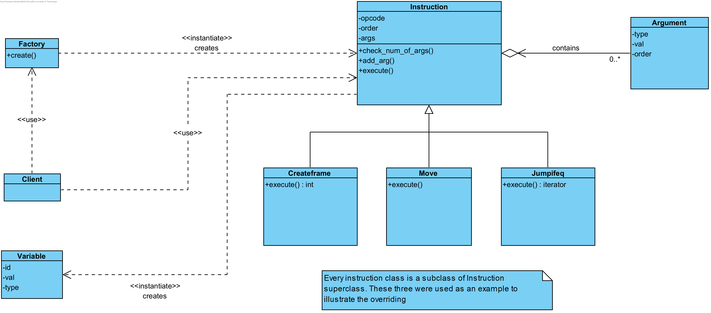

# Implementační dokumentace k 2. úloze do IPP 2022/2023

Jméno a příjmení: Matúš Ďurica

Login: xduric06

## Usage

```utf-8
python3 interpret.py [-h] [--source [file]] [--input [file]]

Interpretting XML file

options:
  -h, --help       show this help message and exit
  --source [file]  XML source file
  --input [file]   Input file
```

## Implementation details

Script consists of ```interpret.py```, which provides parsing of the XML input file, creating and processing instruction objects, ```utils.py```, which contains definitions of multiple utility functions, ie. for parsing decadic escape sequences in string, getting value from symbols etc. and then multiple ```.py``` files which contain definitions of classes and their methods.

User can specify the XML file by using the ```--source``` command-line argument and if desired, user can specify a file, from which the ```READ``` instruction will read instead of ```stdin```, using the ```--input``` command-line argument. At least one of these two command-line arguments has to be specified, if one or the other is missing the interpret is reading from ```stdin```.

### OOP implementation

In my implementation Factory pattern has been used. Factory pattern means that some object is creating other objects. Factory is invoked as a method call from the Factory class, which is defined in ```factory.py``` in ```libs/```.

#### Excerpt from the ```Factory``` class

```python
class Factory:
    @classmethod
    def create(cls, opcode: str, order: int):
        if not re.match(r'^\d+$', str(order)):
            errprint('Bad order!')
            exit(32)
        match opcode.upper():
            case 'NOT':
                return Not(order)
            case 'TYPE':
                return Type(order)
            case 'INT2CHAR':
                return Int2char(order)
            case 'STRLEN':
                return Strlen(order)
            case 'MOVE':
                return Move(order)
```

This meant, that for every instruction, there had to be a separate class, so a correct instruction object would be created. Every instruction is a subclass of the ```Instruction``` superclass, which is defined in ```instruction.py``` in ```libs/```. This way, every instruction has the same methods and inner data, and by overriding the ```execute``` method, correct execution is assured. Another overriding is happening in the ```check_num_of_args``` method, where the number of arguments is checked based on the specified number of arguments of every instruction in the assignment.

Extending by new instructions (for example, the data stack instructions (ie. ```ADDS```, ```MULS```, etc.)) would be really simple - creating new class, with corresponding ```execute``` function and adding a new case into the ```Factory``` class.

Class diagram of my implementation can be seen below (getters, setters and method arguments are not shown):



#### Instruction superclass

```python
from libs.argument import Argument
from .utils import *


class Instruction:
    def __init__(self, order, opcode):
        self._opcode = opcode
        self._order = order
        self._args = []

    def add_arg(self, arg_type, arg_val, arg_order):
        arg_order = arg_order[3:]
        self._args.append(Argument(arg_type, arg_val, arg_order))
        self._args = sorted(self._args, key=lambda x: x.get_order())

    def get_opcode(self) -> str:
        return self._opcode

    def get_order(self) -> int:
        return self._order

    def set_order(self, new):
        self._order = new

    def get_args(self) -> list:
        return self._args

    def check_num_of_args(self):
        if len(self._args) > 0:
            errprint('Too many arguments in instruction!')
            exit(32)

    def execute(self, GF_vars: dict, TF_vars: dict, LF_stack: list, instructions: list, labels: dict, input_file_flag: int, TF_created_flag: int, args, processed_instr, stack, ds):
        """
        Mainly forward declaration for overriding, no real functionality provided

        """
        return
```

#### Example instruction to show overriding

```python
from ..instruction import Instruction
from ..utils import *


class Move(Instruction):
    def __init__(self, order):
        super().__init__(order, 'MOVE')

    def check_num_of_args(self):
        if len(self._args) != 2:
            errprint('Undefined amount of arguments in instruction!')
            exit(32)

    def execute(self, GF_vars: dict, TF_vars: dict, LF_stack: list, instructions: list, labels: dict, input_file_flag: int, TF_created_flag: int, args, processed_instr, stack, ds):
        self.check_num_of_args()
        var_id, var_frame, var_type = get_var(self.get_args()[0].get_val())
        symb_val, symb_frame, symb_type = get_symb(
            self.get_args()[1].get_type(), self.get_args()[1].get_val()
        )
        _ = get_from_frame(
            var_frame, var_id, TF_created_flag, GF_vars, TF_vars, LF_stack)
        if not symb_frame:
            updated = get_from_frame(
                var_frame, var_id, TF_created_flag, GF_vars, TF_vars, LF_stack)
            updated.set_val(symb_val)
            updated.set_type(symb_type)
        else:
            _ = get_from_frame(
                symb_frame, symb_val, TF_created_flag, GF_vars, TF_vars, LF_stack)
            check_var(symb_frame, symb_val, symb_type,
                      GF_vars, TF_vars, LF_stack)
            updated = get_from_frame(
                symb_frame, symb_val, TF_created_flag, GF_vars, TF_vars, LF_stack)
            if not updated.get_val():
                exit(56)
        update_in_frame(var_frame, var_id, updated, GF_vars, TF_vars, LF_stack)
```

## Working principle of the script

Script firstly parses the XML source file, to create a tree-like structure. This tree is then parsed into correct instruction objects, based on the ```opcode``` and ```Argument``` objects which are stored in the instruction objects.

Instruction objects are stored in a list, which is then sorted and their indices are changed to increments of 1, so the implementation of flow control instructions would be easier.

Changing the flow is done by utilizing an inner implementation of a ```for``` cycle. Then, if a flow control instruction returns a new iterator, the cycle iterator is changed and this achieves flow control.

```python
# main interpretting loop
    iterator_obj = iter(instructions)
    while True:
        try:
            current_instruction = next(iterator_obj)
        except StopIteration:
            break

        tmp = iterator_obj

        match current_instruction.get_opcode():
            case 'JUMP' | 'JUMPIFEQ' | 'JUMPIFNEQ' | 'CALL' | 'RETURN':
                iterator_obj = current_instruction.execute(GF_vars, TF_vars, LF_stack, instructions,
                                                           labels, input_file_flag, TF_created_flag, args, current_instruction, call_stack, data_stack)
                if not iterator_obj:
                    iterator_obj = tmp
            case 'CREATEFRAME' | 'PUSHFRAME':
                TF_created_flag = current_instruction.execute(GF_vars, TF_vars, LF_stack, instructions,
                                                              labels, input_file_flag, TF_created_flag, args, current_instruction, call_stack, data_stack)
            case _:
                current_instruction.execute(GF_vars, TF_vars, LF_stack, instructions,
                                            labels, input_file_flag, TF_created_flag, args, current_instruction, call_stack, data_stack)

```

As can be seen in the code excerpt above, the list containing all instruction objects is cycled through, and instructions are executed using ```execute``` method.
